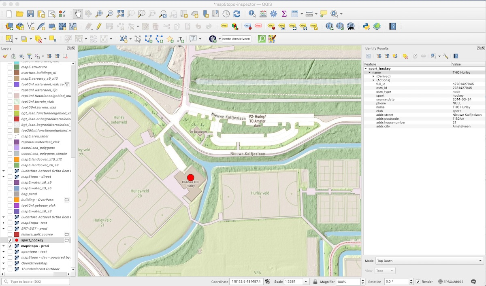

# OSM Data in QGIS

De voornaamste manier is via de [Plugin QuickOSM](https://plugins.qgis.org/plugins/QuickOSM/).
Hiermee kunt u queries samenstellen bijv om in gebied (bbox) OSM data op basis tags binnen te halen.
Uiteindelijk worden deze queries gedaan via de [De OverPass API](https://wiki.openstreetmap.org/wiki/Overpass_API).

## Voorbeeld

Hieronder in twee plaatjes (klik op plaatje voor vergroting). Hele simpele query op `sport=hockey`:

<figure markdown>
{ data-title="qgis-quickosm-query"  }
<figcaption>qgis-quickosm-query</figcaption>
</figure>

en resultaat:

<figure markdown>
{ data-title="qgis-quickosm-result"  }
<figcaption>qgis-quickosm-result</figcaption>
</figure>

