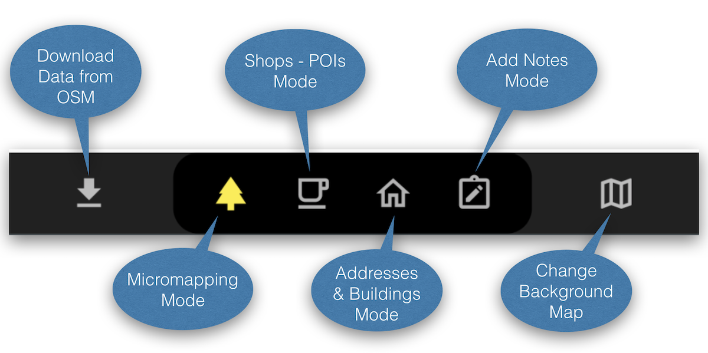
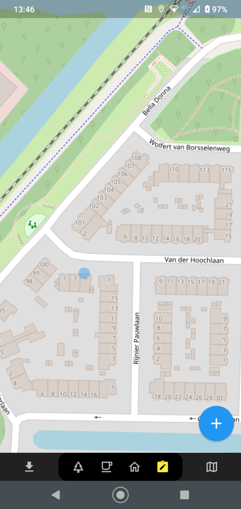

# EveryDoor App

[EveryDoor](https://every-door.app/) is een 
Open Source editor voor de mobiele telefoon om "Points of Interest" (POIs) zoals winkels en 
andere faciliteiten ("amenities") en bijvoorbeeld huisnummers op
zeer gebruiksvriendelijke wijze aan OpenStreetMap toe te voegen of te wijzigen.

Deze app is specifiek ontworpen om gebruikers te helpen om faciliteiten ("amenities") en winkels up-to-date te houden
en zgn. "micro-mapping" te doen. Dit kunnen detail-aspecten zijn zoals het in kaart brengen van 
bomen, informatie-borden, vuilnisbakken, brandweerkranen. Niet al deze objecten zullen op de standaard OSM kaarten
verschijnen, maar omdat ze in de grote OSM database terecht komen, kunnen gespecialiseerde kaarten/apps 
ontwikkeld worden.

EveryDoor [wordt ontwikkeld op GitHub](https://github.com/zverik/every_door) 
door [Ilya Zverev](https://www.openstreetmap.org/user/Zverik), 
een voornaam OSM community member die
al meerdere apps en vele andere aspecten aan OSM heeft bijgedragen sinds 2010.

Ilya was onder andere te gast 
in [De Grote Geo Show ep. 15 - OpenStreetMap Special](https://tv.osgeo.nl/episode/episode-0015/).

## Installeren

[EveryDoor](https://every-door.app/) is beschikbaar voor Android en IOS, zie :

* Android: [Google Play](https://play.google.com/store/apps/details?id=info.zverev.ilya.every_door)
* Android: [F-Droid](https://f-droid.org/packages/info.zverev.ilya.every_door/)
* IOS : [AppStore](https://apps.apple.com/app/every-door/id1621945342)

## Gebruiken

Het gebruik wijst zich min of meer vanzelf. 
U dient een werkend OSM account te hebben. Deze kunt u invoeren door via het menu linksboven in het hoofdscherm het Configuratie scherm
te openen. U ziet daar bovenaan "OSM Account". De overige instellingen zijn momenteel niet van belang.

Er is een hoofdscherm per aktiviteit, dus welke categorie objecten u wilt mappen. In totaal zijn er 4 "Modes". Die 
kunt u "switchen" via de knoppen in het menu geheel onder, hieronder afgebeeld. Daarnaast kunt u steeds
de data uit OSM downloaden met de knop geheel links. Indien u wijzigingen heeft gemaakt zal de pijl
van deze knop naar boven wijzen. In dat geval kunt u met deze knop al uw wijzigingen
naar OSM sturen. Het beste is om wijzigingen "op te sparen" en dan als enkele "changeset" naar OSM te sturen.

<figure markdown>
{ data-title="EveryDoor: Bottom Menu" data-description="EveryDoor: Bottom Menu" }
<figcaption>EveryDoor: Bottom Menu</figcaption>
</figure>

### Scherm 1 - Faciliteiten - Micromapping Mode

Bijvoorbeeld straatmeubulair, bomen, etc. Met +-knop kunt u toevoegen op de plek van zwarte marker.

<figure markdown>
{ data-title="EveryDoor: Micromapping Scherm" data-description="EveryDoor: Micromapping Scherm" }
<figcaption>EveryDoor: Micromapping Scherm</figcaption>
</figure>

### Scherm 2 - Shops, Horeca etc - POI Mode

Ieder nummer in de kaart verwijst naar een POI in de lijst. Met +-knop kunt u toevoegen op de plek van zwarte marker..

<figure markdown>
{ data-title="EveryDoor: Shops Scherm" data-description="EveryDoor: Shops Scherm" }
<figcaption>EveryDoor: Shops Scherm</figcaption>
</figure>

### Scherm 3 - Adressen en Gebouwen Mode

U kunt tags van gebouwen aanpassen en adressen. Tap op een adres of gebouw om aan te passen of via de "Huis-knop" linksonder of "Adres-knop" rechtsonder.
Met de zwarte marker wijst u het adres/gebouw aan. Het effect is hetzelfde als via tappen.

<figure markdown>
{ data-title="EveryDoor: Adressen en Gebouwen Scherm" data-description="EveryDoor: Adressen en Gebouwen Scherm" }
<figcaption>EveryDoor: Adressen en Gebouwen Scherm</figcaption>
</figure>

### Scherm 4 - Notes Mode

Hier kunt u een standaard [OSM Note](https://wiki.openstreetmap.org/wiki/Notes) toevoegen gebonden aan locatie. 
Met blauwe Notitie-knop rechtsonder kunt u een notitie  toevoegen op de plek van zwarte marker. 
Dit is een zeer krachtig middel om voor uzelf of anderen allerlei indicaties toe te voegen, bijvoorbeeld fouten die u tegenkomt maar  niet
in EveryDoor kunt repareren, of een "reminder" voor uzelf om thuis in andere Editor bijv Id of JOSM iets aan te passen.
Op openstreetmap.org kunt u uw eigen notes in uw profiel terugvinden.

<figure markdown>
{ data-title="EveryDoor: Notes Scherm" data-description="EveryDoor: Notes Scherm" }
<figcaption>EveryDoor: Notes Scherm</figcaption>
</figure>

Hier nog wat links die kunnen helpen bij gebruik.

* [OSM Wiki Every_Door](https://wiki.openstreetmap.org/wiki/Every_Door)
* [Tutorial Session by Ilya in Tanzania - Video](https://www.youtube.com/watch?v=q7OscecqUJY)

## Video Intro door Ilya Zverev

**Door naar de [Smart App StreetComplete](streetcomplete.md)!**
